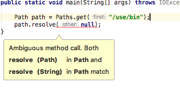

# I/O and NIO

### I/O classes
- File
- FileReader
- BufferedReader
- FileWriter
- BufferedWriter
- PrintWriter
- FileInputStream
- FileOutputStream
- ObjectInputStream
- ObjectOutputStream

:fireworks: Classes with `Stream` in their name are used to read and write bytes, and `Readers` and `Writers` are used to read and write characters.

- #### File
```Java
import java.io.File;

public class Writer1 {
    public static void main(String[] args) {
        File file = new File("myfile.txt"); //there is no file yet
    }
}
```
If you compile and run the program, you will not find any file called `myfile.txt`. When you make a new instance of the class *File, you are not making an actual file; you are just creating a file name.*

We extend the same example above

```Java
import java.io.File;
import java.io.IOException;

public class Writer1 {
    public static void main(String[] args) throws IOException {
        File file = new File("myfile.txt"); //there is no file yet
        System.out.println(file.exists()); //looks for a real file

        boolean newFile = file.createNewFile(); //create a file if not exists
        System.out.println(newFile);

        System.out.println(file.exists());
    }
}
```

This produces output as
- *false*
- *true*
- *true*

:fireworks:
- **boolean exists()** : return true if it can find an actual file.
- **boolean createNewFile()** : creates new file if it doesn't exists.

- #### Working with File and Directories
Create a `Writer` or `Stream`, specially create a `FileWriter`, a `PrintWriter` or a `FileOutputStream`. When you create an instance of one of these classes, you automatically create a file, unless one already exists.

```Java
File file2 = new File("foo.txt"); // no file yet
PrintWriter writer = new PrintWriter(file2); //makes a printwriter object and make a file.
```

But that is not the same case when you have to create a file under a directory.
i.e.
```Java
File mydir = new File("mydir");
File file2 = new File(mydir, "foo.txt");

file2.createNewFile(); //exception if no directory exists.
```
This will generate an exception;
```console
java.io.IOException: No such file or directory
```
For this to work we have to call *mydir.mkDir()*
```Java
File mydir = new File("mydir");
mydir.mkdir();
File file2 = new File(mydir, "foo.txt");

file2.createNewFile();
```

### Files, Path and Paths
Objective: Operate on file and directory paths by using the Paths class.

- Path : This is an interface which replaces `File` as the representation of a file or directory while working with NIO2.
- Paths : This class contains static methods that create `Path` objects by implementing `Path` interface.
- Files : This class contains static methods that work with `Path` objects. Uses `Path` object as parameter.
- File : it's been around since the beginning. `File` and `Path` objects know how to convert each other.


:fireworks: `Files` and `File` despite similarity in names, these objects don't know each other.

```Java
Path p1 = Paths.get("foo/file1.txt");
Path p2 = Paths.get("foo", "file1.txt");
//p1 and p2 are same

System.out.println(Files.exists(p1));

Path dir = Paths.get("foo");
Files.createDirectories(dir); //create directories if not exists

Files.createFile(p1);
System.out.println(Files.exists(p1));
```
### I/O vs NIO2

| Description   | I/O           | NIO2  |
| ------------- |:-------------| :----- |
| Create an empty file.      | File f = new File("test.txt"); f.createNewFile(); | Path path = Paths.get("test.txt"); Files.createFile(path); |
| Create a new Directory     | File f = new File("dir"); f.mkDir();      |   Path path = Paths.get("dir"); Files.createDirectory(path); |
| Create directories including any missing parent directories | File f = new File("a/b/c"); f.mkdirs();      |    Path path = Paths.get("a/b/c"); Files.createDirectories(path); |
| Check if a file or directory exists | File f = new File("test.txt"); f.exists();      |    Path path = Paths.get("test.txt"); Files.exists(path); |

### Copying, Moving and Deleting files.
```Java
Path one = Paths.get("foo/file1.txt"); //exists
Path two = Paths.get("foo/file2.txt"); //exists

Path targ = Paths.get("foo/file12.txt"); //doesn't yet exist
Files.copy(one, targ);
Files.copy(two, targ); //oops, java.nio.file.FileAlreadyExistsException: foo/file12.txt
```
When Java see it's about to override the file, it throws _FileAlreadyExistsException_ as we haven't provided any option incase the file is about to replaced.

```Java
Files.copy(two, targ, StandardCopyOption.REPLACE_EXISTING);
```
Similarly, while trying to delete a file which doesn't exist, `NoSuchFileException` is thrown.
We can safeguard this by using
```Java
Files.deleteIfExists(path);
```
### Retrieving information about a Path
The Path interface defines a bunch of methods that return useful information about the path.

```Java
Path path = Paths.get("/home/java/workspace.note");
System.out.println("getFaileName(): " + path.getFileName());
System.out.println("getName(1): " + path.getName(1));
System.out.println(("getNameCount(): "+ path.getNameCount()));
System.out.println("getParent(): "+path.getParent());
System.out.println("getRoot(): "+path.getRoot());
System.out.println(("subpath(0,2): " + path.subpath(0, 2)));
System.out.println(("toString()" + path.toString()));
```
This produces the following output.
```console
getFaileName(): workspace.note
getName(1): java
getNameCount(): 3
getParent(): /home/java
getRoot(): /
subpath(0,2): home/java
toString()/home/java/workspace.note
```
Another interesting fact about `Path` interface is it extends from `Iterable<Path>`, hence we can iterate with enhance `for` loop.

```Java
int spaces = 1;
Path myPath = Paths.get("tmp", "dir1", "dir2", "dir3", "file.txt");
for (Path subPath : myPath) {
    System.out.format("%" + spaces + "s%s%n", "", subPath);
    spaces +=2;
}
```
which produces the following output:
```console
tmp
  dir1
    dir2
      dir3
        file.txt
```
### Resolving a Path (combining two `Path`)
```Java
Path dir = Paths.get("/home/java");
Path file = Paths.get("models/Model.java");
Path result = dir.resolve(file);
System.out.println("Result: " + result);
```
This produces the absolute path by merging two paths.
```console
Result: /home/java/models/Model.java
```

:fireworks: `resolve` will not check that the directory or file actually exists.

:tada: **Exam Note:**
resolve() methods comes in two falvours. One with a `Path` parameter and the other with a `String` parameter. The tricky part here is that null is avalid value for both a `Path` and `String`. What will happen if you pass `null` as a parameter ?



The compiler can't decide which method to invoke; hence the code **won't compile**.

The following example will _compile without any problem_; because the compiler knows which method to invoke.
```java
Path path = Paths.get("/use/bin");
Path other = null;
path.resolve(other);

path.resolve((String) null);
```
### Relativizing a Path
`Relativize` is just opposite of `resolve`.
`path1.relativize(path2)` means _**give me a path that shows how to go path2 from path1**_

```Java
Path dir = Paths.get("/home/java");
Path music = Paths.get("/home/java/country/gana.mp3");
Path mp3 = dir.relativize(music);
System.out.println(mp3);
```
The output is
```console
country/gana.mp3
```
Now we can try some complex example:
```Java
Path absolute1 = Paths.get("/home/java");
Path absolute2 = Paths.get("/usr/local");
Path absolute3 = Paths.get("/home/java/temp/music.mp3");
Path relative1 = Paths.get("temp");
Path relative2 = Paths.get("temp/music.pdf");
System.out.println("1: "+ absolute1.relativize(absolute3));
System.out.println("2: "+ absolute3.relativize(absolute1));
System.out.println("3: "+ absolute1.relativize(absolute2));
System.out.println("4: "+ relative1.relativize(relative2));
```
The output is
```console
1: temp/music.mp3
2: ../..
3: ../../usr/local
4: music.pdf
```
:tada: Remember `relativize()` and `resolve()` are opposite. Just like `resolve()`, `relativize()` does not check that the path actually exists.

*********************************************
### DirectoryStream
DirectoryStream works like `dir` command in DOS and the `ls` command in UNIX. It can look only one directory. i.e. we have the following directory.
```console
/home
  | - users
          |  -  vafi
          |  -  eyra

```
and DirectoryStream is used to get the list by the following code.
```Java
Path dir = Paths.get("/home/users");
try (DirectoryStream<Path> stream = Files.newDirectoryStream(dir)) {
    //try-with-resources, so we don't have to close the stream explicitly.
    for (Path path : stream) {
        System.out.println(path);
    }
}
```
The output is
```console
vafi
eyra
```
Suppose we want to know the name of directory whose name starts with `v` or `w`.
- "v" or "w" followed  by anything
```java
Path dir = Paths.get("/home/users");
try (DirectoryStream<Path> stream = Files.newDirectoryStream(dir, "[vw]*")) {
    //try-with-resources, so we don't have to close the stream explicitly.
    for (Path path : stream) {
        System.out.println(path);
    }
}
```
This time the output is
```console
vafi
```
:tada: The `*` is a wildcard that means ZERO or more of any characters. Notice this is not a regular expression. DirectoryStream uses something called `glob`.

### FileVisitor
FileVisitor look at subdirectories.
Java provides a `SimpleFileVisitor`. You extend it and override one or more methods. Then you call `Files.walkFileTree`, which recursively look through directory structure and call method on `Visitor` subclass. i.e. we have the following directory structure and you want to delete all class files.
```console
/home
  | - src
        | - Test.java
        | - Test.class
        | - dir
              | - AnotherTest.java
              | - AnotherTest.class
```
```Java
import java.io.IOException;
import java.nio.file.*;
import java.nio.file.attribute.BasicFileAttributes;

public class RemoveClassFiles extends SimpleFileVisitor<Path> {

    @Override
    public FileVisitResult visitFile(Path file, BasicFileAttributes attrs) throws IOException {
        if (file.getFileName().endsWith(".class")) {
            Files.delete(file);
        }
        return FileVisitResult.CONTINUE;
    }

    public static void main(String[] args) throws IOException {
        RemoveClassFiles dirs = new RemoveClassFiles();
        Files.walkFileTree(Paths.get("/home/src"), dirs);
    }
}
```
- This is a simple `FileVisitor` having one method override `visitFile()`. This method is invoked for every file in the directory structure. It checks the extension of file and delete if appropriate. In our case it deletes two class files.
- If you notice there are two parameter to `visitFile()`. One is the `path` object and the other one is `BasicFileAttributes` interface - which let you find if the current file is a directory and many other similar piece of data.
- Finally `visitFile()` returns `FileVisitResult.CONTINUE` which tell the method that it should keep looking through directory structure.

Let's look at another callback method of `SimpleFileVisitor` class. That is `preVisitDirectory()` and all other methods.
Suppose the file directory structure as follows:
```console
/home
    | - a.txt
    | - emptyChild
    | - child
          | - b.txt
          | - grandChild
                  | - c.txt
```
```Java
import java.io.IOException;
import java.nio.file.*;
import java.nio.file.attribute.BasicFileAttributes;

public class PrintDirs extends SimpleFileVisitor<Path> {

    @Override
    public FileVisitResult preVisitDirectory(Path dir, BasicFileAttributes attrs) throws IOException {
        System.out.println("pre: " + dir);
        return FileVisitResult.CONTINUE;
    }

    @Override
    public FileVisitResult visitFile(Path file, BasicFileAttributes attrs) throws IOException {
        System.out.println("file: " + file);
        return FileVisitResult.CONTINUE;
    }

    @Override
    public FileVisitResult visitFileFailed(Path file, IOException exc) throws IOException {
        return FileVisitResult.CONTINUE;
    }

    @Override
    public FileVisitResult postVisitDirectory(Path dir, IOException exc) throws IOException {
        System.out.println("post: " + dir);
        return FileVisitResult.CONTINUE;
    }

    public static void main(String[] args) throws IOException {
        PrintDirs dirs = new PrintDirs();
        Files.walkFileTree(Paths.get("/home"), dirs);
    }
}
```
This might get the following output.
```console
pre: /home
file: /home/a.txt
pre: /home/child
file: /home/child/b.txt
pre: /home/child/grandChild
file: /home/child/grandChild/c.txt
post: /home/child/grandChild
post: /home/child
pre: /home/emptyChild
post: /home/emptyChild
post: /home
```
:fireworks: Note that Java goes down as deep as it can before returning back up the tree. This is called _**deep-first search**_. we said "might" because files and directories at the same level can get visited in either order.

Now suppose we change the return type in `preVisitDirectory()` as 'FileVisitResult.SKIP_SUBTREE'as follows:
```Java
@Override
public FileVisitResult preVisitDirectory(Path dir, BasicFileAttributes attrs) throws IOException {
    System.out.println("pre: " + dir);
    String name = dir.getFileName().toString();
    if (name.equals(dir)) {
        return FileVisitResult.SKIP_SUBTREE;
    }
    return FileVisitResult.CONTINUE;
}
```
Now the output is
```console
pre: /home
file: /home/a.txt
pre: /home/child
pre: /home/emptyChild
post: /home/emptyChild
post: /home
```
This skips the entire child subtree; we don't see the file `b.txt` or it's subdirectory: `grandchildren`; also we don't see the `post` visit call.


 Now if we change the return value from `FileVisitResult.SKIP_SUBTREE` to `FileVisitResult.SKIP_TERMINATE`. The output will be
 ```console
 pre: /home
 file: /home/a.txt
 pre: /home/child
 ```
So as soon as the child directory came up, the program stops walking the tree.

Now we need to see the behaviour if the return type is changed to `FileVisitResult.SKIP_SIBLINGS`?
The output is same as previous example
```console
pre: /home
file: /home/a.txt
pre: /home/child
```
`SKIP_SIBLINGS` is a combination of `SKIP_SUBTREE` and don't look in any folder at the same level.

### WatchService
Observe the changes in a directory by using the WatchService interface.

Suppose we have the following directory structure
```console
/foo
  | - bar
  | - other
  | - file1.txt
```
and we want to keep the watch service for delete entry on `bar` directory.

```Java
import java.io.IOException;
import java.nio.file.*;

public class WatchOnDelete {
    public static void main(String[] args) throws IOException, InterruptedException {
        Path dir = Paths.get("foo");

        WatchService watcher = FileSystems.getDefault().newWatchService();
        dir.register(watcher, StandardWatchEventKinds.ENTRY_DELETE);

        WatchKey key;
        while(true) {
            key = watcher.take();

            for(WatchEvent<?> event : key.pollEvents()) {
                WatchEvent.Kind<?> kind = event.kind();

                System.out.println(kind.name());
                System.out.println(kind.type());
                System.out.println(event.context());

                String name = event.context().toString();
                if (name.equals("bar")) {
                    System.out.println("Directory now deleted, now we can proceed!!!");
                    return; // end the program; we found what we were waiting for.
                }
            }
            key.reset(); // keep looking for events
        }
    }
}
```
This will wait until `bar` directory is deleted. Once deleted, the following o/p will print on console.
```console
ENTRY_DELETE
interface java.nio.file.Path
bar
Directory now deleted, now we can proceed!!!
```
The basic flow of `WatchService`:
- Create a new `WatchService`
- Register it on a `Path` listing to one or more events.
- Loop until you are no longer interested in these events.
- Get a `WatchKey` from the `WatchService`
- Call 'key.pollEvents' and do something with the events.
- Call 'key.reset()' to look for more events.

You can register multiple events on `WatchService` as follows:
```java
dir1.register(watcher, ENTRY_DELETE);
dir2.register(watcher, ENTRY_DELETE, ENTRY_CREATE);
dir3.register(watcher, ENTRY_DELETE, ENTRY_CREATE, DELETE_MODIFY);
```

Within the loop, you need to get a `WatchKey`. There are two ways to do this.
```Java
watcher.take(); // wait "forever" for the event
watcher.poll(); //get event if present right now.
watcher.poll(10, TimeUnit.SECONDS); //wait up-to 10 seconds.
watcher.poll(1, TimeUnit.MINUTES); //wait up-to 1 minute for an event.
```
Finally, we call `key.reset()`. This is very important. If we forget to call reset, the program will work for the first event, but then you will not be notified for any other events.
:fireworks: `WatchService` only watches the files and directories immediately beneath it.

### How Serialization Affects Inheritance
If you are a serializable class but your superclass is not serializable, then any instance varibales you inherit from superclass will be rest to the values they were given during the original construction of the object. This is because the `non-serializable` class `constructor` will run.

```java
import java.io.*;

public class SuperNotSerial {
    public static void main(String[] args) {
        Dog d = new Dog("Fido", 35);
        System.out.println("Before: " + d.name + " " + d.weight);

        //Serialize
        try {
            FileOutputStream fs = new FileOutputStream("test.ser");
            ObjectOutputStream os = new ObjectOutputStream(fs);)
            os.writeObject(d);
            os.close();
        } catch (Exception e) {
            e.printStackTrace();
        }

        //deserialize
        try {
            FileInputStream fi = new FileInputStream("test.ser");
            ObjectInputStream ois = new ObjectInputStream(fi);
            d = (Dog) ois.readObject();

            ois.close();
        } catch(Exception e) {
            e.printStackTrace();
        }
        System.out.println("After: " + d.name + " " + d.weight);
    }
}


class Dog extends Animal implements Serializable {
    String name;
    Dog(String name, int weight) {
        this.name = name;
        this.weight = weight; //inherited.
    }
}

class Animal { // not serializable
    int weight = 42;
}
```
which produces the output:
```console
Before: Fido 35
After: Fido 42
```
:tada: Static varibales are never saved as part of the object's state..because they do not belongs to the object!

### The java.io.Console class
The `Console` class makes it easy to accept input from the command line, both echoed and non-echoed(such as password).
- You can get `Console` instance using `System.getConsole()`. There are two methods to capture the input.
- `readLine()`: returns a string containing whatever the user keys in.
- `readPassword()`: This method doesn't return a String; it returns a character array.
Here is the reason for this: Once you have got the password, you can verify it and then absolutely remove it from memory. If a `String` is returned, it could exist in a poll somewhere in memory and perhaps some hacker could find it.
