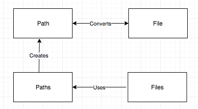

# I/O and NIO

### I/O classes
- File
- FileReader
- BufferedReader
- FileWriter
- BufferedWriter
- PrintWriter
- FileInputStream
- FileOutputStream
- ObjectInputStream
- ObjectOutputStream

:fireworks: Classes with `Stream` in their name are used to read and write bytes, and `Readers` and `Writers` are used to read and write characters.

- #### File
```Java
import java.io.File;

public class Writer1 {
    public static void main(String[] args) {
        File file = new File("myfile.txt"); //there is no file yet
    }
}
```
If you compile and run the program, you will not find any file called `myfile.txt`. When you make a new instance of the class *File, you are not making an actual file; you are just creating a file name.*

We extend the same example above

```Java
import java.io.File;
import java.io.IOException;

public class Writer1 {
    public static void main(String[] args) throws IOException {
        File file = new File("myfile.txt"); //there is no file yet
        System.out.println(file.exists()); //looks for a real file

        boolean newFile = file.createNewFile(); //create a file if not exists
        System.out.println(newFile);

        System.out.println(file.exists());
    }
}
```

This produces output as
- *false*
- *true*
- *true*

:fireworks:
- **boolean exists()** : return true if it can find an actual file.
- **boolean createNewFile()** : creates new file if it doesn't exists.

- #### Working with File and Directories
Create a `Writer` or `Stream`, specially create a `FileWriter`, a `PrintWriter` or a `FileOutputStream`. When you create an instance of one of these classes, you automatically create a file, unless one already exists.

```Java
File file2 = new File("foo.txt"); // no file yet
PrintWriter writer = new PrintWriter(file2); //makes a printwriter object and make a file.
```

But that is not the same case when you have to create a file under a directory.
i.e.
```Java
File mydir = new File("mydir");
File file2 = new File(mydir, "foo.txt");

file2.createNewFile(); //exception if no directory exists.
```
This will generate an exception;
```console
java.io.IOException: No such file or directory
```
For this to work we have to call *mydir.mkDir()*
```Java
File mydir = new File("mydir");
mydir.mkdir();
File file2 = new File(mydir, "foo.txt");

file2.createNewFile();
```

### Files, Path and Paths
Objective: Operate on file and directory paths by using the Paths class.

- Path : This is an interface which replaces `File` as the representation of a file or directory while working with NIO2.
- Paths : This class contains static methods that create `Path` objects by implementing `Path` interface.
- Files : This class contains static methods that work with `Path` objects. Uses `Path` object as parameter.
- File : it's been around since the beginning. `File` and `Path` objects know how to convert each other.



:fireworks: `Files` and `File` despite similarity in names, these objects don't know each other.

```Java
Path p1 = Paths.get("foo/file1.txt");
Path p2 = Paths.get("foo", "file1.txt");
//p1 and p2 are same

System.out.println(Files.exists(p1));

Path dir = Paths.get("foo");
Files.createDirectories(dir); //create directories if not exists

Files.createFile(p1);
System.out.println(Files.exists(p1));
```
#### I/O vs NIO2

| Description   | I/O           | NIO2  |
| ------------- |:-------------| :----- |
| Create an empty file.      | File f = new File("test.txt"); f.createNewFile(); | Path path = Paths.get("test.txt"); Files.createFile(path); |
| Create a new Directory     | File f = new File("dir"); f.mkDir();      |   Path path = Paths.get("dir"); Files.createDirectory(path); |
| Create directories including any missing parent directories | File f = new File("a/b/c"); f.mkdirs();      |    Path path = Paths.get("a/b/c"); Files.createDirectories(path); |
| Check if a file or directory exists | File f = new File("test.txt"); f.exists();      |    Path path = Paths.get("test.txt"); Files.exists(path); |

#### Copying, Moving and Deleting files.
```Java
Path one = Paths.get("foo/file1.txt"); //exists
Path two = Paths.get("foo/file2.txt"); //exists

Path targ = Paths.get("foo/file12.txt"); //doesn't yet exist
Files.copy(one, targ);
Files.copy(two, targ); //oops, java.nio.file.FileAlreadyExistsException: foo/file12.txt
```
When Java see it's about to override the file, it throws FileAlreadyExistsException as we haven't provided any option incase the file is about to replaced.

```Java
Files.copy(two, targ, StandardCopyOption.REPLACE_EXISTING);
```
Similarly, while trying to delete a file which doesn't exist, `NoSuchFileException` is thrown.
We can safeguard this by using
```Java
Files.deleteIfExists(path);
```
